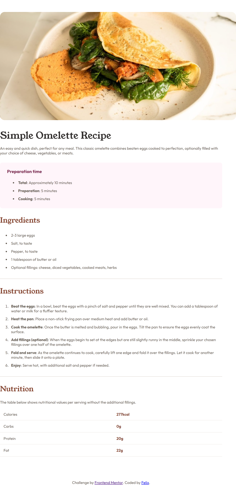

# Frontend Mentor - Recipe page solution

This is a solution to the [Recipe page challenge on Frontend Mentor](https://www.frontendmentor.io/challenges/recipe-page-KiTsR8QQKm). 

## Table of contents

- [Overview](#overview)
  - [Screenshot](#screenshot)
  - [Built with](#built-with)
- [Author](#author)

## Overview

### Screenshot

### Built with

- HTML5
- CSS

## Author

- Frontend Mentor - [@feficherry](https://www.frontendmentor.io/profile/feficherry)
